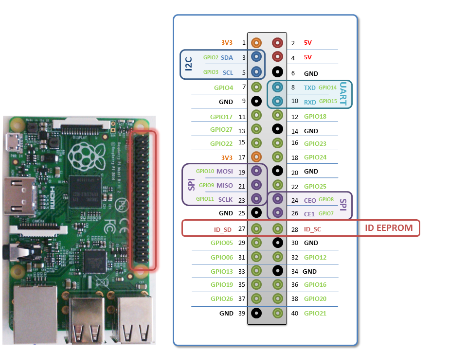

# RaspberryPi

Anleitungen und Hilfestellungen rund um den RaspberryPI

## Algemein ##
* [Befehle](Befehle.md) die auf der Komandozeile nützlich sind.  
* [Mailclient](Mailclient.md) Mails von der Komandozeile schicken  
* [HDD](HDD.md) Festplatte anschließen

## Haussteuerung ##
* [FHEM](Fhem.md)
* [I2C](I2C.md)

## Dateisynchronisierung ##
* [OwnCloud](OwnCloud.md)
* [Seafile](Seafile.md)
* [Syncthing](Syncthing.md)

## Dateiübertragung Dateizugriff ##
* [Samba](Samba.md)
* [FTP](FTP.md)

## Multimedia ##

* [OSMC](OSMC.md)

## Hardware ##
GPIO Pin Belegung bei B+ Boards

